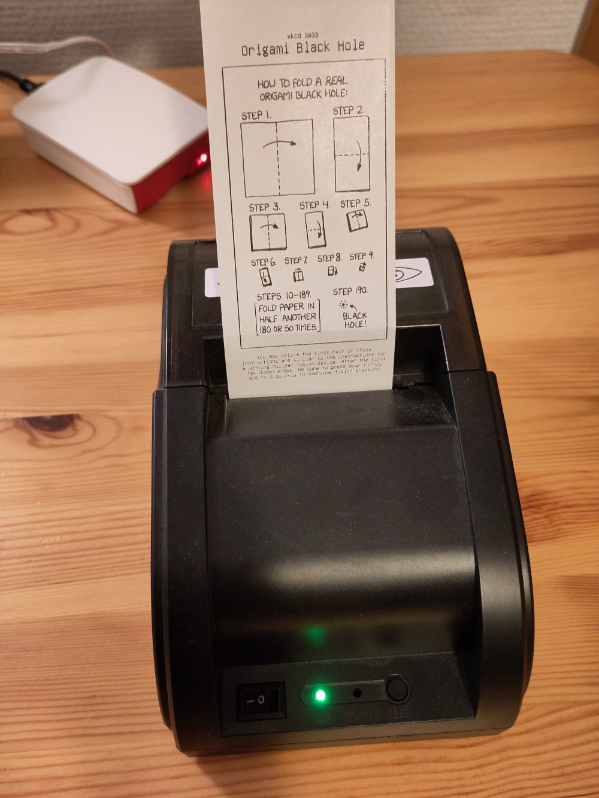
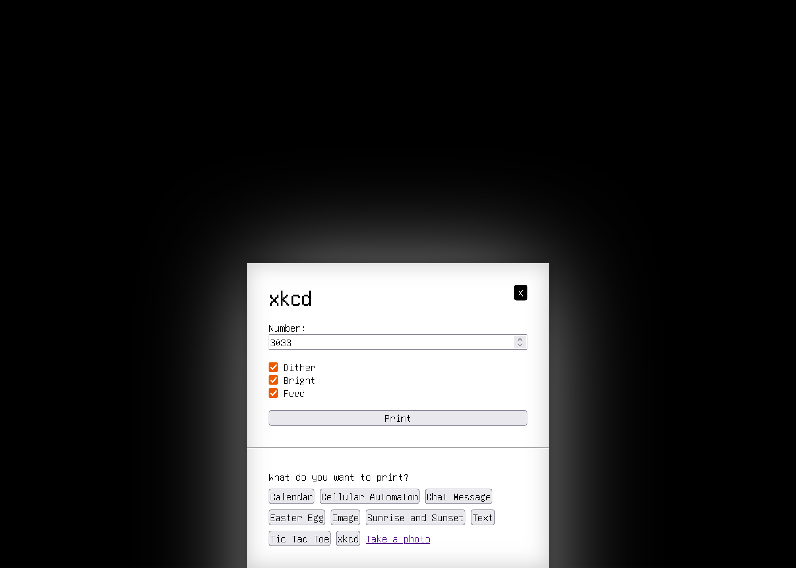

# showbits

Displaying pixel-perfect images on a thermal printer.

## Developing

After cloning the repo, run `meta/build-all` once. Some parts of the project use
files from other parts of the project (e.g. the thermal printer includes the
typst plugin wasm file in its binary). The build script produces these
intermediate artifacts.

## Thermal printer ideas

- Appointments, tasks for the day
- Business card that looks like a receipt
- Commit history (maybe across repos)
- Emails (live)
- HN front page
- Issues on a GitHub repo (like tickets - "when your number is called, ...")
- Large image using multiple strips
- Live graph (a new row of pixels every few seconds)
- Measuring tape
- Personal finances in the form of a receipt
- QR codes
- Quote (`fortune`, maybe `cowsay`)
- RSS feeds (live?)
- SSH login attempts (live)
- Stats in the form of a receipt
- Sudoku
- Text banner (text flows parallel to paper)
- Weather report
- Wiki To Go

Implemented:

- Calendar
- Cellular automaton (1D)
- Chat messages (euph, twitch)
- Instant camera
- Procedural easter egg generator
- Sunrise, sunset
- xkcd (current, random)

## Todos

- [ ] Sensible limits on all string inputs
- [ ] Better debug logging
